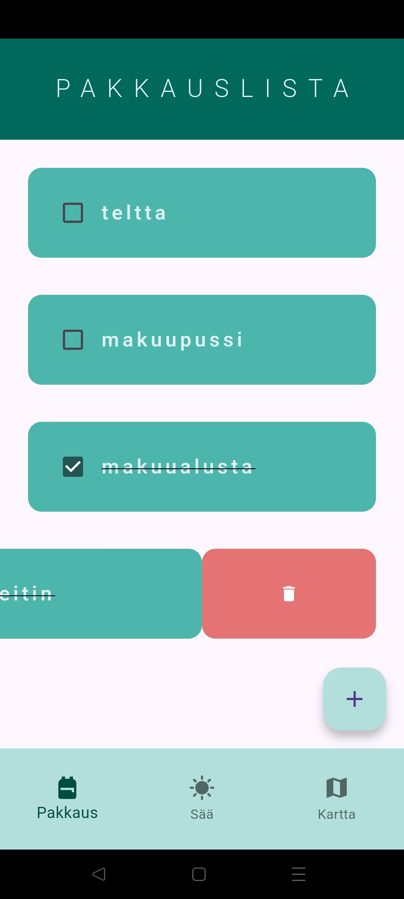
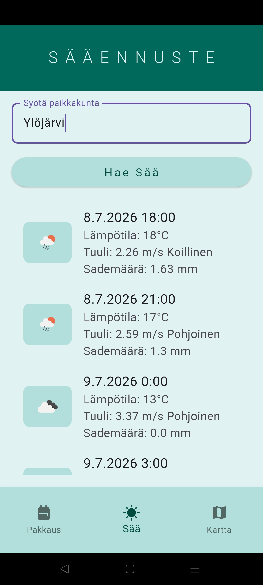
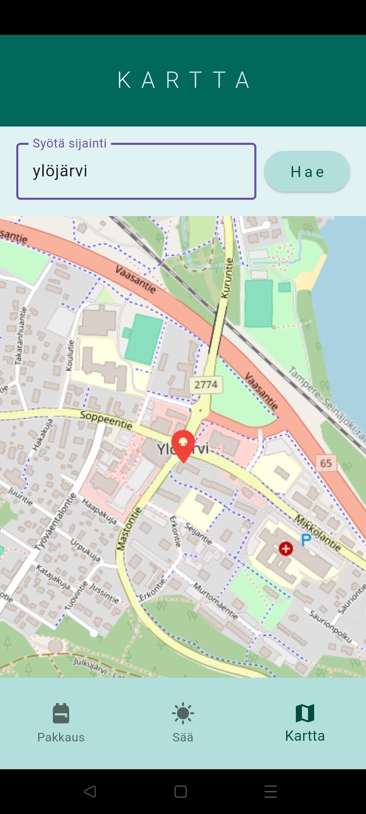

# Retkeilysovellus

  
  
  

Retkeilysovellus on Flutterilla toteutettu mobiilisovellus, joka auttaa käyttäjää 
valmistautumaan retkille ja matkoille. Sovellus yhdistää pakkauslistan, sääennusteen 
ja kartan samaan käyttöliittymään.

## Ominaisuudet

- Pakkauslista, joka tallentuu paikallisesti Hive-tietokantaan
- Sääennuste OpenWeatherMap API:n avulla
- Kartta ja paikkahaku OpenStreetMapin avulla
- Käyttäjän nykyisen sijainnin näyttäminen

## Käytetyt teknologiat

- Flutter
- Dart
- Hive
- flutter_map
- OpenWeatherMap API
- OpenStreetMap
- Geolocator
- HTTP

## Projektin tavoite

Projektin tavoitteena oli harjoitella Flutter-pohjaista mobiilisovelluskehitystä sekä ulkoisten palveluiden hyödyntämistä käytännössä. Työssä perehdyin REST-rajapintojen käyttöön, paikalliseen tiedon tallennukseen Hive-tietokannalla, sijaintipalveluihin sekä OpenWeatherMap- ja OpenStreetMap-palveluiden integrointiin.

## Huomio

Sääominaisuus käyttää OpenWeatherMap API:a.

Projektiin ei sisälly API-avainta, joten sovellusta testattaessa tulee lisätä oma OpenWeatherMap API -avain tiedostoon `weather_page.dart`.

## Tekijä

Vilja Korkala
